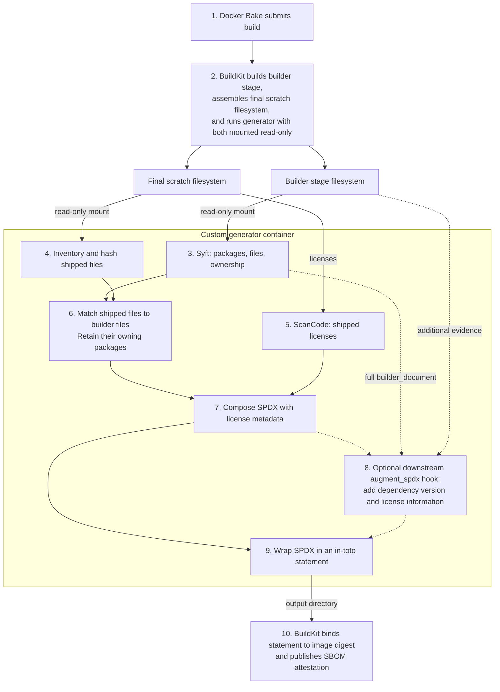

# Extension image SBOMs

BuildKit runs the custom generator as a separate container and mounts the
builder-stage and final scratch filesystems read-only. The generator replaces
the default SBOM scanner; Bake and BuildKit still handle building the image
and attaching its attestations.



Numbers show the processing sequence for one target/platform; arrows show
data flow. Unnumbered filesystem nodes are inputs. Step 8 runs only when a
downstream hook file is present in the builder filesystem.

The generator decides what is in the SBOM: shipped files and their identified
packages, plus license and distro metadata. It starts from its own Syft scan
of the builder stage, not Bake's default SBOM. BuildKit pulls the generator
image, supplies the mounts, and incorporates its output into the image index
alongside provenance.

## Downstream extension hook

The dashed path in the diagram is an optional extension point. Without a
hook file, the generator wraps the composed SPDX directly. With the
hook enabled, augmentation runs after final-payload
filtering and license composition, before in-toto statement wrapping.

```python
from hooks import HookContext

def augment_spdx(document: dict, context: HookContext) -> dict:
    """Add additional dependency version and license information."""
    return document
```

The context exposes `api_version` (currently `1`), `extension_name`, `platform`,
and read-only filesystem mounts at `builder_path` and `final_path`, plus
`context.builder_document`: the complete, unfiltered SPDX JSON document
produced by the builder-stage Syft scan, before final-file matching or package
filtering. This is the existing parsed `builder_document`, not Syft's native
JSON format, and requires no additional scan. Hooks should treat it as
read-only evidence; the `document` argument is the composed final-payload SPDX
that the hook augments.
Final-file identifiers and checksums are available in `document["files"]`.

A downstream hook could reuse Syft's full package, file, and relationship
data and read additional evidence from the builder stage to add dependency
version and license information for shipped artifacts to the SPDX document.
Running after filtering prevents these additions from being discarded by the existing
file-ownership selection logic.

The upstream runner trusts the hook's returned document and wraps it
directly in an in-toto statement. Downstream code is responsible for
producing valid SPDX and for evidence that added components belong to shipped
artifacts. BuildKit receives one completed SPDX statement through the
existing output protocol.

Place a Python file defining `augment_spdx(document, context)` at
`/usr/local/share/cnpg-sbom/augment_spdx.py` in the extension's builder stage. For
example, add this instruction to that stage, using a source path relative to
the build context:

```dockerfile
COPY sbom/augment_spdx.py /usr/local/share/cnpg-sbom/augment_spdx.py
```

The generator loads that file from the read-only builder mount and calls its
function. No hook file means a no-op. The hook must return the complete SPDX
document; it can modify the supplied document or return a replacement. Load
and hook errors fail the build. There is no additional validation of the
hook's returned SPDX.

Downstream builds use the same generator image. The hook and its evidence
remain in the builder stage and need not be copied into scratch. The hook
executes in the generator's Python environment, so dependencies installed
only in the builder are not automatically available. Standard-library
processing of precomputed JSON needs no additional generator dependencies.

## Build locally

Local builds use Docker Bake directly and do not require the SBOM generator:

```bash
docker buildx bake -f docker-bake.hcl -f h3/metadata.hcl h3-4_2_3-18-trixie
```

The `sbom_generator` Bake variable defaults to empty, which uses BuildKit's
native `type=sbom` generator. Set it to a generator image reference to use the
custom generator. Use `--builder NAME` to select a configured builder, or
`--print` to inspect the Bake definition.

The separate `sbom-generator.yml` workflow builds the generator when anything
under `sbom-generator/` or the publishing workflow changes. Pull requests validate
the build; changes on `main` publish multi-platform `latest` and `sha-<commit>` tags.

Extension CI consumes the image reference in `bake_targets.yml`. Renovate's
existing Docker digest-pinning configuration tracks `latest`, adding its first
digest after publication and proposing digest updates for subsequent builds.
Generator source changes do not rebuild extensions directly; updating the image
reference in `bake_targets.yml` triggers those builds. When adopting this workflow
in another repository, update both the image reference and its Renovate
`depName` to the publishing owner's GHCR namespace.

Immediately before Bake, CI edits the checked-out extension Dockerfile to insert
`ARG BUILDKIT_SBOM_SCAN_STAGE=builder` as line 2, after the syntax directive
where present. This exposes the builder
stage to the custom generator. The declaration is required by
[BuildKit stage scanning](https://docs.docker.com/build/metadata/attestations/sbom/#scan-stages);
passing only a build argument does not enable it.

To test custom SBOM generation locally, publish a generator image accessible
to BuildKit, add the same declaration to your extension Dockerfile, and set
`sbom_generator` to the image reference when running Bake. Ordinary local
builds need neither preparation step.

## Attestation layout

Published extension images use BuildKit's SBOM generator protocol. The local
generator emits one in-toto Statement with an SPDX predicate for the platform
payload; BuildKit supplies the final image subject, attestation manifest, and
image index. A multi-platform index therefore contains one image and one
combined provenance/SPDX attestation for each platform.

The SPDX creation metadata identifies the generator as
`Tool: cnpg-sbom-generator-<git-sha>`. The publishing workflow embeds its full
build Git SHA in the generator image through `SBOM_GENERATOR_REVISION`; this
also sets the image's `org.opencontainers.image.revision` label. Its document
annotation retains the generator name, Git SHA as `generatorVersion`, and source
repository URL; the immutable generator image digest
selected by the workflow provides the stronger reproducibility boundary.
Local image builds can pass `--build-arg SBOM_GENERATOR_REVISION=$(git rev-parse HEAD)`
when building from an unchanged checkout. Without a supplied revision, the
version is explicitly `unknown`, including when running the composer directly.

During generation, BuildKit logs show phase start/completion and elapsed time.
Long Syft subprocesses emit a heartbeat every 10 seconds.
ScanCode's output and diagnostics go directly to stdout without filtering.
ScanCode controls its own progress display; non-terminal logs may omit per-file messages.
License-file preparation reports its file and chunk counts.

The examples below use the H3 image produced by this repository. Replace
`INDEX_DIGEST` with the immutable index digest returned by
`docker buildx imagetools inspect`; the placeholder is intentional because a
tag is not a reproducible security reference.

## Verify the image

The retained release workflow is `.github/workflows/bake_targets.yml`. A
production image built from `main` is verified with the workflow identity and
GitHub's OIDC issuer:

```bash
IMAGE='ghcr.io/cloudnative-pg/h3:4.2.3-18-trixie@sha256:INDEX_DIGEST'

cosign verify "$IMAGE" \
  --certificate-identity-regexp='^https://github.com/cloudnative-pg/postgres-extensions-containers/.github/workflows/bake_targets\.yml@refs/heads/main$' \
  --certificate-oidc-issuer='https://token.actions.githubusercontent.com'
```

Substitute the actual GitHub owner in both the image and identity. A branch or
pull-request build has a different workflow identity. Local validation uses a
disposable Cosign key and `COSIGN_TLOG_UPLOAD=false`; it validates signature
storage and digest binding, not the future hosted OIDC identity.

## Retrieve the platform SBOM

Use Buildx's standard platform selector and SPDX template. The extension image
reference is the only difference from the base PostgreSQL extraction form:

```bash
docker buildx imagetools inspect "$IMAGE" \
  --format '{{ json (index .SBOM "linux/amd64").SPDX }}' \
  > extension-amd64.spdx.json

trivy sbom --scanners vuln,license extension-amd64.spdx.json
```

For the other platform, repeat the same command with `linux/arm64` and a
separate output file:

```bash
docker buildx imagetools inspect "$IMAGE" \
  --format '{{ json (index .SBOM "linux/arm64").SPDX }}' \
  > extension-arm64.spdx.json

trivy sbom --scanners vuln,license extension-arm64.spdx.json
```

Each report covers one platform. Native-only builds should be extracted and
scanned with `linux/amd64` or `linux/arm64` matching the built image; validate
the second architecture only after the final multi-platform phase.

The composed document describes the shipped extension payload, including
copied system libraries and `/licenses` files. It does not describe the whole
PostgreSQL container or runtime dependencies supplied by the base image. Scan
the base PostgreSQL image and separately mounted extension images separately.

## Direct image scans

Debian-based PostgreSQL images retain installed-package metadata, so a direct
remote image scan can identify OS packages:

```bash
trivy image --image-src remote --platform linux/amd64 --scanners vuln \
  ghcr.io/cloudnative-pg/postgresql:18-minimal-trixie
```

Scratch extension payloads generally do not retain that ownership/version
metadata. The extracted composed SPDX is the intended inventory-based path.
`trivy image` scans the image filesystem and does not consume the BuildKit SBOM
just because the index contains an SBOM attestation; `trivy sbom` consumes the
document extracted above.

Extraction and vulnerability/license scanning are separate from authenticity.
Cosign verifies the signed index digest. Buildx extraction reads attestation
members whose OCI subject points to a platform image, and the in-toto subject
and descriptor digests bind each statement and blob to that graph. Trivy then
scans the extracted SPDX content; it does not verify the signature.

For the first hosted rollout, publish the generator before running extension
CI, then let Renovate pin the published `latest` manifest digest. GHCR must be
readable by the consuming workflows and Renovate (through package visibility
or configured credentials). The initial reference has no digest until that
publication; subsequent digest updates select the generator used by extension
builds. Local validation does not exercise hosted OIDC/publication jobs.
